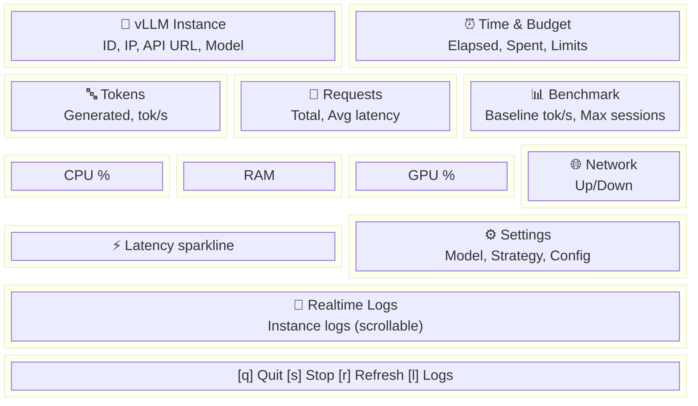

# Dashboard — TUI Monitoring

## Khởi động

```bash
# Mở dashboard (cần instance đang chạy)
bun run deploy dashboard

# Alias ngắn
bun run deploy dash
```

> ⚠️ Cần deploy instance trước: `bun run deploy start`

## Layout

Dashboard sử dụng grid 12x12 với các panel:



## Panels

### 🚀 vLLM Instance
- Instance ID, IP address
- API URL (http://IP:PORT/v1)
- Model đang chạy

### ⏰ Time & Budget
- Thời gian đã chạy
- Chi phí đã dùng ($)
- Countdown: giờ còn lại (nếu dùng `--hours`)
- Budget còn lại (nếu dùng `--budget`)

### 🔤 Tokens
- Tổng tokens đã generate
- Tokens/giây trung bình

### 📡 Requests
- Tổng API requests
- Latency trung bình (ms)

### 📊 Benchmark
- Baseline throughput (tok/s)
- Latency (ms)
- Max concurrent sessions ước tính
- Peak throughput tại concurrency cao nhất
- Thời gian chạy benchmark gần nhất
- Dữ liệu từ `benchmark_report.json` (tự tạo sau deploy hoặc chạy `bun run deploy benchmark`)

### CPU / RAM / GPU Gauges
- Real-time utilization %
- Color-coded (xanh < 70%, vàng < 90%, đỏ > 90%)

### 🌐 Network
- Upload/Download speed
- Connection status

### ⚡ Latency Sparkline
- Biểu đồ response time theo thời gian
- Giúp phát hiện degradation

### ⚙ Settings
- Model, strategy, GPU preference
- Instance type (on-demand/spot), $/hr
- Hours/budget limits
- Watchdog status, auto-recover status
- Context length, prefix caching
- **Spot instance:** trạng thái (●running / ●interrupted), tiết kiệm ước tính vs on-demand

### 📜 Realtime Logs (Virtual Scroll)
- Logs từ instance (vLLM, supervisor)
- **Virtual scroll** — chỉ render dòng hiển thị, buffer tối đa 500 dòng
- Mouse wheel scroll up/down, auto-scroll resume khi scroll về cuối
- Auto-fetch mỗi 15 giây
- Deduplicated — không hiện dòng trùng
- Dòng dài tự truncate (250 chars) để tránh lag

## Hotkeys

| Key | Action |
|-----|--------|
| `q` / `Ctrl+C` | Thoát dashboard |
| `s` | Stop instance + thoát |
| `r` | Refresh tất cả data |
| `l` | Fetch logs ngay lập tức |

## Kết hợp với flags

```bash
# Dashboard với auto-shutdown countdown
bun run deploy dashboard --hours 2

# Dashboard với budget tracking
bun run deploy dashboard --budget 1.50

# Dashboard + budget + hours
bun run deploy dashboard --hours 4 --budget 2.00
```

## Auto-benchmark sau Deploy

Khi chạy `bun run deploy start`, sau khi instance ready:

1. CLI tự đợi model load xong (poll `/v1/models`, tối đa 10 phút)
2. Chạy quick benchmark (c=1, 2, 4)
3. Lưu kết quả vào `benchmark_report.json`
4. Dashboard tự hiện benchmark data

Nếu muốn chạy benchmark đầy đủ (c=1,2,4,8,16):
```bash
bun run deploy benchmark
```

## Spot Instance trên Dashboard

Khi dùng `--spot`, dashboard hiển thị thêm:

- **Header:** cảnh báo đỏ `⚠ INTERRUPTED` nếu instance bị gián đoạn
- **Time panel:** uptime thực tế từ Vast.ai API (chỉ tính thời gian chạy)
- **Settings panel:**
  - Trạng thái instance: `●running` (xanh) hoặc `●interrupted` (đỏ)
  - Tiết kiệm spot: `Saved: ~$X.XX vs on-demand`
  - Auto-recover status (nếu bật `--auto-recover`)
- **Logs:** thông báo recovery khi instance được phục hồi tự động

## Tips

- Dashboard **auto-refresh** mỗi 5 giây
- Mở dashboard sau khi API ready (`bun run deploy test` trước)
- Nếu panels trống → model chưa load xong, đợi vài phút
- Dashboard chạy trên terminal — cần terminal đủ rộng (≥80 cols, ≥24 rows)
- **Spot users:** Dashboard tự phát hiện interruption, không cần monitor thủ công
