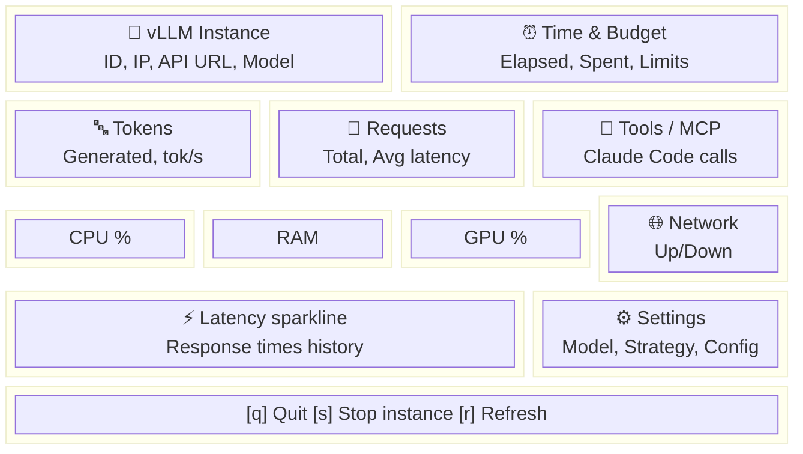

# Dashboard — TUI Monitoring

## Khởi động

```bash
# Mở dashboard (cần instance đang chạy)
bun run deploy dashboard

# Alias ngắn
bun run deploy dash
```

> ⚠️ Cần deploy instance trước: `bun run deploy start`

## Layout

Dashboard sử dụng grid 12x12 với các panel:



## Panels

### 🚀 vLLM Instance
- Instance ID, IP address
- API URL (http://IP:PORT/v1)
- Model đang chạy

### ⏰ Time & Budget
- Thời gian đã chạy
- Chi phí đã dùng ($)
- Countdown: giờ còn lại (nếu dùng `--hours`)
- Budget còn lại (nếu dùng `--budget`)

### 🔤 Tokens
- Tổng tokens đã generate
- Tokens/giây trung bình

### 📡 Requests
- Tổng API requests
- Latency trung bình (ms)

### 🔧 Tools / MCP
- Claude Code tool calls
- MCP server stats

### CPU / RAM / GPU Gauges
- Real-time utilization %
- Color-coded (xanh < 70%, vàng < 90%, đỏ > 90%)

### 🌐 Network
- Upload/Download speed
- Connection status

### ⚡ Latency Sparkline
- Biểu đồ response time theo thời gian
- Giúp phát hiện degradation

### ⚙ Settings
- Model, strategy, GPU preference
- Instance type, $/hr
- Hours/budget limits
- Watchdog status
- Context length, prefix caching

## Hotkeys

| Key | Action |
|-----|--------|
| `q` / `Ctrl+C` | Thoát dashboard |
| `s` | Stop instance + thoát |
| `r` | Refresh data ngay |

## Kết hợp với flags

```bash
# Dashboard với auto-shutdown countdown
bun run deploy dashboard --hours 2

# Dashboard với budget tracking
bun run deploy dashboard --budget 1.50

# Dashboard + budget + hours
bun run deploy dashboard --hours 4 --budget 2.00
```

## Tips

- Dashboard **auto-refresh** mỗi 5 giây
- Mở dashboard sau khi API ready (`bun run deploy test` trước)
- Nếu panels trống → model chưa load xong, đợi vài phút
- Dashboard chạy trên terminal — cần terminal đủ rộng (≥80 cols, ≥24 rows)
